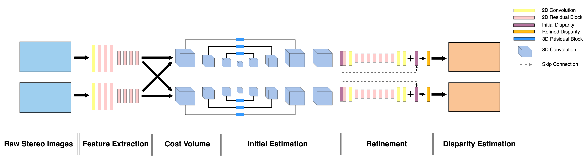

# UWStereoNet - Disparity Estimation Module

+ This repository contains source code for the Disparity Estimation Module for UWStereoNet developed in UWStereoNet: Unsupervised Learning for Depth Estimation and Color Correction of Underwater Stereo Imagery. During training, the model takes stereo images pairs as inputs and output both left and right disparity maps. The code is in TensorFlow.

# UWStereoNet - Color Correction Module

Source code for the UWStereoNet Color Correction Module is available [here](https://github.com/kskin/UWStereo).

# Usage:

Directory structure:
```
    ├── ...
    ├── data
    │   ├── cityscapes
    │   │   ├── train
    │   │   │   ├── left
    │   │   │   │   └── *.png
    │   │   │   └── right
    │   │   │       └── *.png
    │   │   └── val
    │   │       ├── left
    │   │       │   └── *.png
    │   │       └── right
    │   │           └── *.png
    └── ...
```

To train a model with the cityscapes dataset:

```
python3 train_model.py \
--left_dir data/cityscapes/train/left/ \
--right_dir data/cityscapes/train/right/ \
--left_val_dir data/cityscapes/val/left/ \
--right_val_dir data/cityscapes/val/right/ \
--dataset cityscapes \
--gpu 1 \
--is_val
```

To visualize tensorboard:
```
tensorboard --logdir summary/
```

To export model:
```
python3 export_model.py \
--checkpoint_dir checkpoint/dropuwstereo_disp_cityscapes/ \
--export_dir export/dropuwstereo_disp_cityscapes/ \
--gpu 1
```

To do inference:
```
python3 inference.py \
--export_dir export/dropuwstereo_disp_cityscapes/ \
--output_dir prediction_result/dropuwstereo_disp_cityscapes/ \
--left_dir data/test/left/ \
--right_dir data/test/right/ \
--gpu 1
```
Note: make sure the shape of input image is dividable by 32


# Citations

If you find this work useful for your research, please cite UWStereoNet in your publications.

```
@inproceedings{Skinner:2019aa,
	Author = {Skinner, Katherine A and Zhang, Junming and Elizabeth Olson and M. Johnson-Roberson},
	Booktitle = {{IEEE} International Conference on Robotics and Automation},
	Date-Added = {2019-01-26 10:00:49 -0500},
	Date-Modified = {2019-01-26 10:01:54 -0500},
	Keywords = {conf},
	Note = {accepted},
	Title = {UWStereoNet: Unsupervised Learning for Depth Estimation and Color Correction of Underwater Stereo Imagery},
	Year = {2019}}
```
